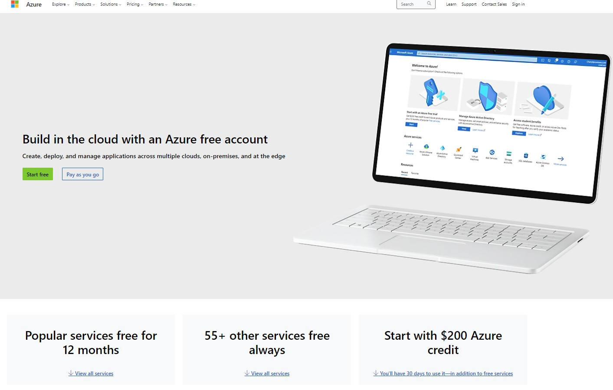
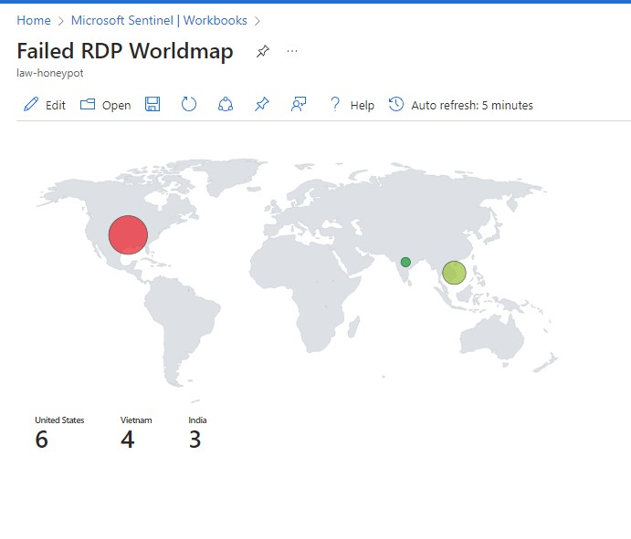
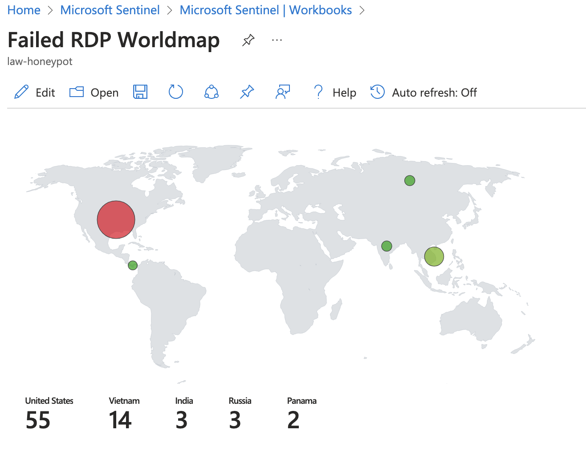

<h1>Microsoft Azure Sentinel | Using a SIEM for live attacks</h1>

Huge thanks to Josh Madakor for creating this awesome lab! It was really fun to recreate and learn about. His video can be found [here](https://youtu.be/RoZeVbbZ0o0?si=2d2N-lM7PYsF8Twc)

<h2>Learning Objectives:</h2>

- Configuration & Deployment of Microsoft Azure virtual machines, Log Analytics Workspaces, and Microsoft Sentinel
- Hands-on experience with Microsoft Sentinel, a cloud-native SIEM (Security Information and Event Management)
- Understanding Windows Security Event logs
- Using Kusto Query Language (KQL) to query logs
- Displaying attack data on a dashboard with Workbooks (Viewing it as a World Map)

<h2>Tools</h2>

- Microsoft Azure
- Remote Desktop Protocol
- 3rd party API:  [IP Geolocation](https://ipgeolocation.io/)
- Custom [powershell script](https://github.com/joshmadakor1/Sentinel-Lab/blob/main/Custom_Security_Log_Exporter.ps1) by Josh Madakor

### Overview
.jpg)

<h2>Steps</h2>
  
### Creating a Microsoft Azure account
> Creating a new Azure account to have $200 credit for 30 days

### Creating a Virtual Machine to be our Honeypot
> I went back to change the machine size so it was not running slowly

### Changing VM security to allow all inbound traffic
> Only did this so the machine can be found faster

### Log Analytics Workspace
>Purpose of this is to ingest logs from the VM, create a log with the data, then have it be seen in the SIEM

### Changing Microsoft Defender for Cloud security

### Setting up Microsoft Sentinel
> Created the SIEM and then choose workbooks to add the honeypot

.jpg)

### Log into VM with Remote Desktop
> Once logged into VM I turned off Windows Firewall and tested the connection

### Using Custom powershell script and Making Free IP Geolocation account for API

### Waiting for logs to populate

### Map on inital set-up

### End of Project
>left the VM running for roughly 4 hours before stopping it. This was my final results

